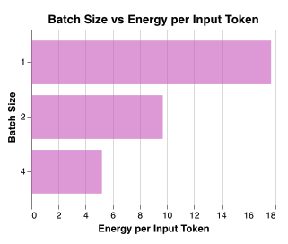
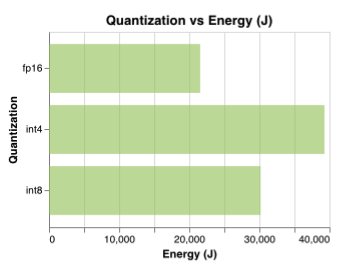
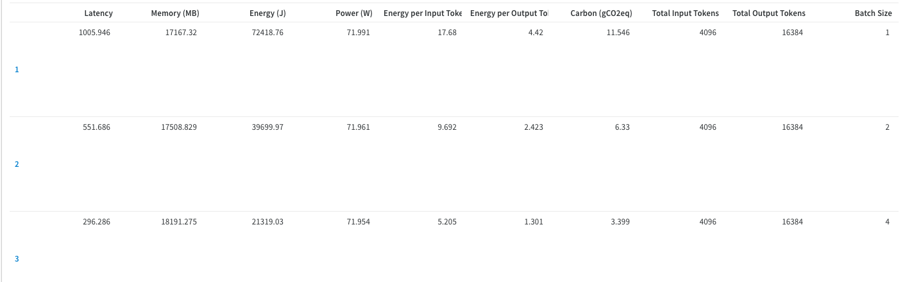

# Benchmarking Energy Consumption for LLM Inference Across Diverse Workloads
*Group Members: Sri Iyengar, Anushka Pachary, Radhika Patel*  
*Mentored by: Jishan Desai, Rakene Chowdhury*

---

## 📋 Overview

This project provides a standardized benchmarking suite to evaluate the energy efficiency of Large Language Models (LLMs) during inference. By systematically varying inference workloads—particularly **input length, output length, quantization type, batch size and dataset**, we measure their impact on: 
- latency (sec)
- Max GPU Memory Usage (MB)
- Total Energy Consumption (Joules)
- Carbon Footprint (gCO₂eq)
- Energy per input/output token

across **different models**. 

The benchmarking pipeline is implemented using Hugging Face Transformers, bitsandbytes for quantization, Zeus for power profiling. Metrics are visualized and tracked via Weights & Biases (W&B) and optionally logged into csv files locally. 

### Motivation

LLMs like LLaMA-2 and DeepSeek require significant energy for inference. However, few tools exist to rigorously benchmark and compare their energy profiles across realistic workloads (and configurations).

This project builds a reproducible pipeline to:
- Run controlled inference experiments across models, datasets, and quantization levels.
- Monitor real-time GPU power usage and calculate associated energy and carbon footprint.
- Log detailed metrics (latency, memory, energy per token, carbon impact).
- Visualize performance across sweeping variables like input/ouput size, model type, dataset type, batch size.

--- 

### Installation 

We recommend setting up a virtual environment before installing dependencies:

```
python -m venv venv
source venv/bin/activate       # On Windows: venv\Scripts\activate
pip install -r requirements.txt
```
Make sure nvidia-smi and GPU drivers are properly installed if running on an NVIDIA system.


### How To Benchmark

The main entry point is scripts/evaluate.py, which:

- Loads datasets, defines model configs and sweep params 

- Sweeps one variable at a time across options like:

    - input_length: short (128), medium (512), long (1024)
    - output_length: same as above
    - batch_size: 1, 2, 4
    - quantization: int4, int8, fp16
    - dataset: Alpaca, GSM8K
    - model: Llama-7b, Deepseek-R1-Distill-Qwen-7B

- Logs metrics to visual plots in W&B

### Run Benchmark
```
python scripts/evaluate.py
```
---

### Power Monitoring Tools
This project supports two power monitoring backends:

1. Zeus (default): Used live inside evaluate.py and testing.py.

2. nvidia-smi logging: Via metrics/monitor_gpu.py (manual alternative).

The file carbon_utils.py uses real-time carbon intensity data via the [Electricity Maps API](https://portal.electricitymaps.com/docs/getting-started#authorization).


### Datasets

We use two open-source datasets for prompting:

* 🦙 Alpaca – instruction-following prompts

* 📐 GSM8K – math and reasoning tasks

See utils/data.py for how these are preprocessed and sampled.

---

### Directory Structure

```
├── metrics/                 # Energy and power monitoring utilities
│   ├── monitor_gpu.py       # (For manual tracking) nvidia-smi based GPU power logger
│   ├── parse_power_log.py   # (For manual logging) CSV power log parser
│   └── zeusml.py            # Wrapper for Zeus energy monitor
│
├── results/                 # Output metrics and plots
│   ├── gpu_power_log.csv    # Raw GPU power logging (from nvidia-smi)
│   ├── latency_plot.png
│   ├── memory_plot.png
│   ├── metrics_output.csv   # Master log of all experiment results
│   └── power_plot.png
│
├── scripts/                 # Core experiment driver and plot scripts
│   ├── evaluate.py          # Main script for controlled benchmarking experiments
│   └── plot_results.py      # (Manual/local plotting) Static bar plot generation for Llama
│
├── utils/                   # Helper modules
│   ├── carbon_utils.py      # Converts energy to CO2eq using real-time carbon intensity API
│   ├── data.py              # Loads and cleans datasets (Alpaca, GSM8K)
│   ├── load_model.py        # Loads Hugging Face models with quantization
│   └── testing.py           # Runs sweep-based experiments and logs results
│
├── wandb/                   # Dir created for wandb runs
├── .gitignore
├── README.md
└── requirements.txt         # Python package dependencies

```

The files monitor_gpu.py, parse_power_log.py, and plot_results.py were developed during early stages of the project for GPU monitoring and visualization using nvidia-smi. While not part of the current Zeus-based pipeline, they remain fully functional. Users may optionally reintegrate them for custom logging or offline analysis.

### File Descriptions

- metrics
    - zeusml.py: Wrapper class around Zeus energy monitor for starting/stopping energy tracking, reporting, saving CSVs, and optionally plotting power traces
    - monitor_gpu.py: Uses nvidia-smi to log GPU power draw, utilization, and memory usage at a 1-second interval to a CSV file.
    - parse_power_log.py: Parses nvidia-smi power logs to compute total energy (Joules) and average power (Watts), assuming 1-second sampling intervals.

- results/
    - gpu_power_log.csv: Example output from monitor_gpu.py containing timestamped power and memory usage data from nvidia-smi.
    - metrics_output.csv: Main output CSV where all inference metrics from evaluate.py are stored for later visualization or analysis.
    - results/*.png: Static bar plots (latency, memory, power) generated during earlier visualization stages for selected models and datasets.

- scripts/ 
    - evaluate.py: Main driver script for running controlled LLM inference experiments across various configurations. Logs metrics to CSV and Weights & Biases (W&B) using Zeus for energy monitoring.
    - plot_results.py: Generates static bar plots (latency, memory, power, energy) from metrics_output.csv for earlier LLaMA-2 experiments using Seaborn.

- utils/
    - load_model.py: Loads Hugging Face LLMs with support for quantization (fp16, int8, int4) using bitsandbytes, and configures tokenizers with appropriate padding and trust settings.
    - data.py: Loads, cleans, and formats datasets (alpaca, gsm8k) for benchmarking. Also includes build_prompt() to create model-ready input strings.
    - testing.py: Runs per-sweep experiments, handles batching, collects inference metrics (latency, energy, memory, carbon), and writes results to CSV.
    - carbon_utils.py: Fetches real-time carbon intensity via Electricity Maps API and computes carbon emissions from energy use in grams CO₂-equivalent.

- wandb/: directory gets generated during experiment runtime, contains logs metrics for each experiment and metadata


### Sample Results

These imagse represent a very small subset of results we have generated through our experiments: 






### Wandb

All visualizations and tables can be viewed on using our [Wandb dashboard](https://wandb.ai/benchmarking-energy-consumption-llms-inference/llm-inference-energy-benchmarking/?nw=nwuserrpp2142). 

The dashboard is divided into panels - each illustrating the impacts of each variable/configuration for a given energy consumption metric (energy, latency). It represents how different variables (batch size, quantization, etc.) affect a particular metric we are trying to benchmark (for eg., carbon emissions). The TABLES panel presents the data captured across each sweep for all metrics. The Runs Panel allows the viewer to capture the visualizations based on each variable (for eg, how does batch size impact latency, energy, power, etc)

### Future Work:

- Increase memory to try baseline fp32 quantization level 
- Benchmarking across multiple hardware configurations